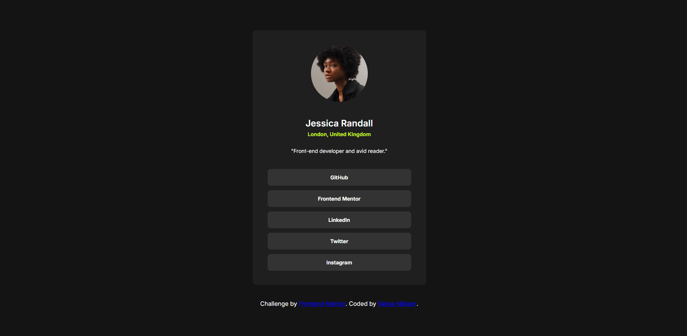

# Frontend Mentor - Social links profile solution

This is a solution to the [Social links profile challenge on Frontend Mentor](https://www.frontendmentor.io/challenges/social-links-profile-UG32l9m6dQ). Frontend Mentor challenges help you improve your coding skills by building realistic projects. 

## Table of contents

- [Overview](#overview)
  - [The challenge](#the-challenge)
  - [Screenshot](#screenshot)
  - [Links](#links)
- [My process](#my-process)
  - [Built with](#built-with)
  - [What I learned](#what-i-learned)
  - [Continued development](#continued-development)
  - [Useful resources](#useful-resources)
  - [AI Collaboration](#ai-collaboration)
- [Author](#author)

## Overview

### The challenge

In this challange we ware assinet to make a social links profile.
With the adisonal challange that we needed to add a focus & hover state to the interactive pats of this profile.

### Screenshot

### Links

- Live Site URL: [ live site here](https://mythage.github.io/social-links-profile-main/)

### Built with

- Semantic HTML5 markup
- CSS custom properties
- Flexbox

### What I learned

One of the biggest challages and traps are with Flexbox. It is a powerful tool but it can also do your overal layout more harm then good. so was is stuggeling with the fact that my buttons did not want to go the full given with. Only to find out I give it the command myself that it was not allowed to go beyond the text given.

### Useful resources

- [W3schools CSS](https://www.w3schools.com/css/default.asp) - This helped me for looking up the options I had to my disposel and selecting the correct one for the task.

### AI Collaboration

AI was this time my guiding hand. given to him exta paramaters that no code writing was allowed and he was only able to tell me what I was able to do beter. 
It became a second eye to make me look deeper and bether at my code.

## Author

- Website - [Sietse Nijdam](https://www.your-site.com) (still in development)
- Frontend Mentor - [@Mythage](https://www.frontendmentor.io/profile/Mythage)
- LinkedIn - [Sietse Nijdam](https://www.linkedin.com/in/sietse-nijdam-41a39596/)

